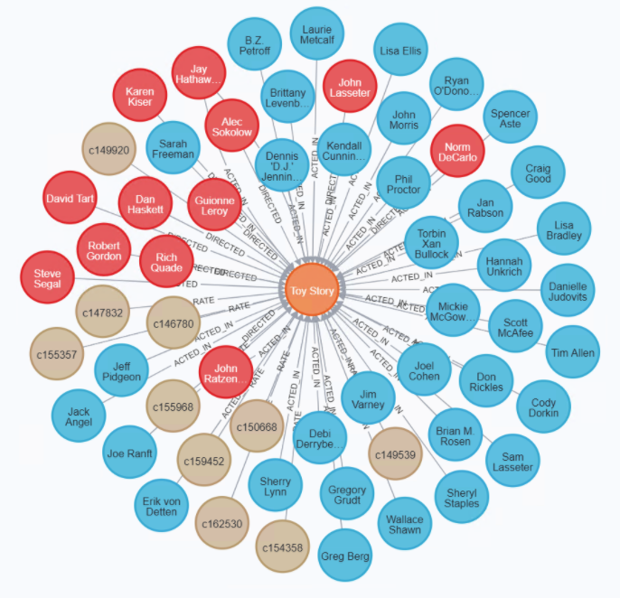

<!-- 
The template of this README file is from https://github.com/othneildrew/Best-README-Template 

MIT License

Copyright (c) 2018 Othneil Drew

Permission is hereby granted, free of charge, to any person obtaining a copy
of this software and associated documentation files (the "Software"), to deal
in the Software without restriction, including without limitation the rights
to use, copy, modify, merge, publish, distribute, sublicense, and/or sell
copies of the Software, and to permit persons to whom the Software is
furnished to do so, subject to the following conditions:

The above copyright notice and this permission notice shall be included in all
copies or substantial portions of the Software.

THE SOFTWARE IS PROVIDED "AS IS", WITHOUT WARRANTY OF ANY KIND, EXPRESS OR
IMPLIED, INCLUDING BUT NOT LIMITED TO THE WARRANTIES OF MERCHANTABILITY,
FITNESS FOR A PARTICULAR PURPOSE AND NONINFRINGEMENT. IN NO EVENT SHALL THE
AUTHORS OR COPYRIGHT HOLDERS BE LIABLE FOR ANY CLAIM, DAMAGES OR OTHER
LIABILITY, WHETHER IN AN ACTION OF CONTRACT, TORT OR OTHERWISE, ARISING FROM,
OUT OF OR IN CONNECTION WITH THE SOFTWARE OR THE USE OR OTHER DEALINGS IN THE
SOFTWARE.
-->
[![Contributors][contributors-shield]][contributors-url]
[![Forks][forks-shield]][forks-url]
[![Stargazers][stars-shield]][stars-url]
[![Issues][issues-shield]][issues-url]
[![MIT License][license-shield]][license-url]
[![LinkedIn][linkedin-shield]][linkedin-url]


<!-- PROJECT LOGO -->
<br />
<p align="center">
  <!-- <a href="https://github.com/othneildrew/Best-README-Template">
    
  </a> -->

  <h2 align="center">Neo4j Data Processing</h3>

  <p align="center">
    Analyze movies related data using neo4j and more!
    <br />
    <a href="https://github.com/zixuanzhang98/neo4j-data-processing"><strong>Explore the docs »</strong></a>
    <br />
    <a href="https://youtu.be/wvrD743SXdU">View Demo</a>
    ·
    <a href="https://github.com/zixuanzhang98/neo4j-data-processing/issues">Report Bug</a>
    ·
    <a href="https://github.com/zixuanzhang98/neo4j-data-processing/issues">Request Feature</a>
  </p>
</p>


<!-- TABLE OF CONTENTS -->
<details open="open">
  <summary>Table of Contents</summary>
  <ol>
    <li>
      <a href="#about-the-project">About The Project</a>
      <ul>
        <li><a href="#built-with">Built With</a></li>
      </ul>
    </li>
    <li>
      <a href="#usage">Usage</a>
      <ul>
        <li><a href="#prerequisites">Prerequisites</a></li>
        <li><a href="#instructions">Instructions</a></li>
      </ul>
    </li>
    <li><a href="#contributors">Contributors</a></li>
    <li><a href="#contributing">Contributing</a></li>
    <li><a href="#license">License</a></li>
    <li><a href="#contact">Contact</a></li>
    <li><a href="#acknowledgements">Acknowledgements</a></li>
  </ol>
</details>


<!-- ABOUT THE PROJECT -->
## About The Project
This big data project utilizs Neo4j Graph Database to analyze Movies data from IMDb to provide insight about movies, actors, and customers.

We ask questions like:
- What is the max/min/avg of the MovieLens ratings for “Avatar”?
- How many directors Christian Bale and Michael Caine worked with?
- Which actor/actresses does a specific customer probably like the most, who we can recommend to this customer in the future,  based on all the movies he/she rated?

Here's the [project report](CSCI5751_Project1_Phase3_Avatar.pdf) and a visual representation of a small fraction of data in the database:



### Built With
* [neo4j](https://https://neo4j.com/)
* [Cypher](https://neo4j.com/developer/cypher/)
* [python](https://www.python.org/)


<!-- USAGE EXAMPLES -->
## Usage

Use the following instructions to achieve the same database state.

### Prerequisites

* `python3` is used for data cleansing and validation. 
  ```sh
  brew install python
  ```
* `pipenv` is used for modern dependency management
  ```sh
  brew install pipenv
  ```

### Instructions

1. Download the required [dataset](https://drive.google.com/drive/folders/1eJtPlbBq3LAYYaHFybdL6Jp8gPt0wuNY?usp=sharing).

2. Cleanse and validate the above dataset with provided python3 [code](data-preprocessing/phase3_data_preprocessing.ipynb) (or you can directly download validated data directly from [here](https://drive.google.com/drive/folders/1nULKryZUJT_OnRDUNhvSgOj4oWx9V7sM?usp=sharing)).

3. Copy the datasets into Neo4j import folder and open Neo4j browser.

4. Follow the comment and run the cypher code inside the [load-csv-v2.cypher](cypher/load-csv-v2.cypher) file to import the data into the Neo4j database.

5. Execute cypher queries in the [business-questions-v2.cypher](cypher/business-questions-v2.cypher) file or write your own queries.

## Contributors
This project is a collective effort of the following members:
- @Karashan
- @StrongWeiUMN
- @LuyaoZhang5380
- @zixuanzhang98


<!-- CONTRIBUTING -->
## Contributing

Contributions are what make the open source community such an amazing place to be learn, inspire, and create. Any contributions you make are **greatly appreciated**.

1. Fork the Project
2. Create your Feature Branch (`git checkout -b feature/AmazingFeature`)
3. Commit your Changes (`git commit -m 'Add some AmazingFeature'`)
4. Push to the Branch (`git push origin feature/AmazingFeature`)
5. Open a Pull Request


<!-- LICENSE -->
## License

Distributed under the MIT License. See `LICENSE` for more information.


<!-- CONTACT -->
## Contact

Zixuan Zhang - zixuanzhang.x@gmail.com

Project Link: [https://github.com/zixuanzhang98/neo4j-data-processing](https://github.com/your_username/repo_name)


<!-- ACKNOWLEDGEMENTS -->
## Acknowledgements
* [Neo4j](https://neo4j.com/)
* [Best-README-Template](https://github.com/othneildrew/Best-README-Template)


<!-- MARKDOWN LINKS & IMAGES -->
<!-- https://www.markdownguide.org/basic-syntax/#reference-style-links -->
[contributors-shield]: https://img.shields.io/github/contributors/zixuanzhang98/neo4j-data-processing.svg?style=for-the-badge
[contributors-url]: https://github.com/zixuanzhang98/neo4j-data-processing/graphs/contributors
[forks-shield]: https://img.shields.io/github/forks/zixuanzhang98/neo4j-data-processing.svg?style=for-the-badge
[forks-url]: https://github.com/zixuanzhang98/neo4j-data-processing/network/members
[stars-shield]: https://img.shields.io/github/stars/zixuanzhang98/neo4j-data-processing.svg?style=for-the-badge
[stars-url]: https://github.com/zixuanzhang98/neo4j-data-processing/stargazers
[issues-shield]: https://img.shields.io/github/issues/zixuanzhang98/neo4j-data-processing.svg?style=for-the-badge
[issues-url]: https://github.com/zixuanzhang98/neo4j-data-processing/issues
[license-shield]: https://img.shields.io/github/license/zixuanzhang98/neo4j-data-processing.svg?style=for-the-badge
[license-url]: https://github.com/zixuanzhang98/neo4j-data-processing/blob/master/LICENSE.txt
[linkedin-shield]: https://img.shields.io/badge/-LinkedIn-black.svg?style=for-the-badge&logo=linkedin&colorB=555
[linkedin-url]: https://linkedin.com/in/zixuanzhang98
[product-screenshot]: images/screenshot.png